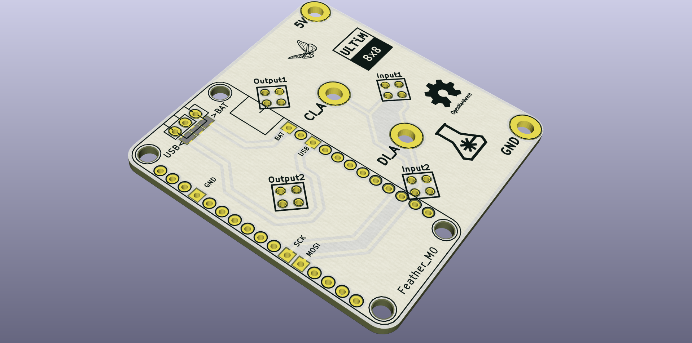

# feather_v3

An add-on board to the Ultim8x8 LED Matrix for mounting an Adafruit Feather M0.

Use 4 pin male headers on ultim8x8 at either of two possible locations -- Input1/Output1 or Input2/Output2

Use a 2.54mm pitch slide switch/header+jumper mounted either at JP1 or JP2, to select between USB supply or BAT (external LiPo).

Instead of using a Switch, use shorting pads near the switch pads to permanently select one of the two supply options - USB or BAT.

License
-------
[CERN Open Hardware Licence v1.2 ]

[CERN Open Hardware Licence v1.2 ]:http://www.ohwr.org/attachments/2388/cern_ohl_v_1_2.txt
