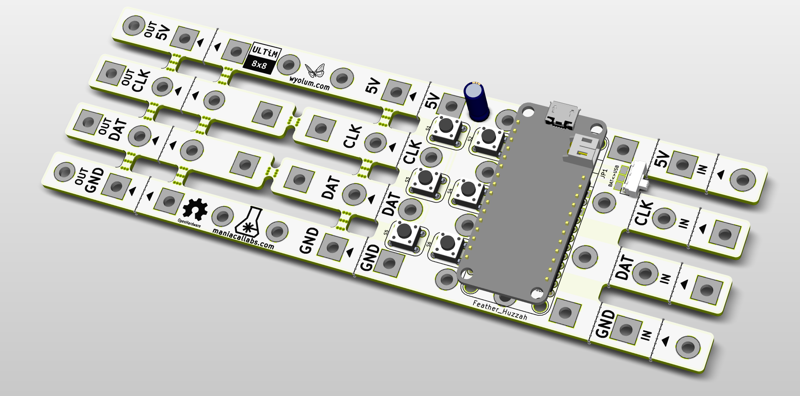
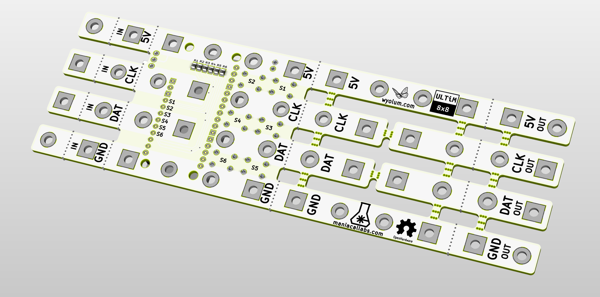

# ultim_bus

A PCB "bus bar" to allow three ultim8x8 modules to be connected easily. Mouse bites allow it to be snapped off easily. With some imagination, can be used to expand to larger matrices.

The first panel can be populated with a Huzzah. There are six SMD switches connected to 14, 12, 13, 15, 0, 16, 2 on the Huzzah, with pull up resistors (SMD 0805). Switch functions can be arbitrarily assigned in code.

License
-------
[CERN Open Hardware Licence v1.2 ]

[CERN Open Hardware Licence v1.2 ]:http://www.ohwr.org/attachments/2388/cern_ohl_v_1_2.txt
